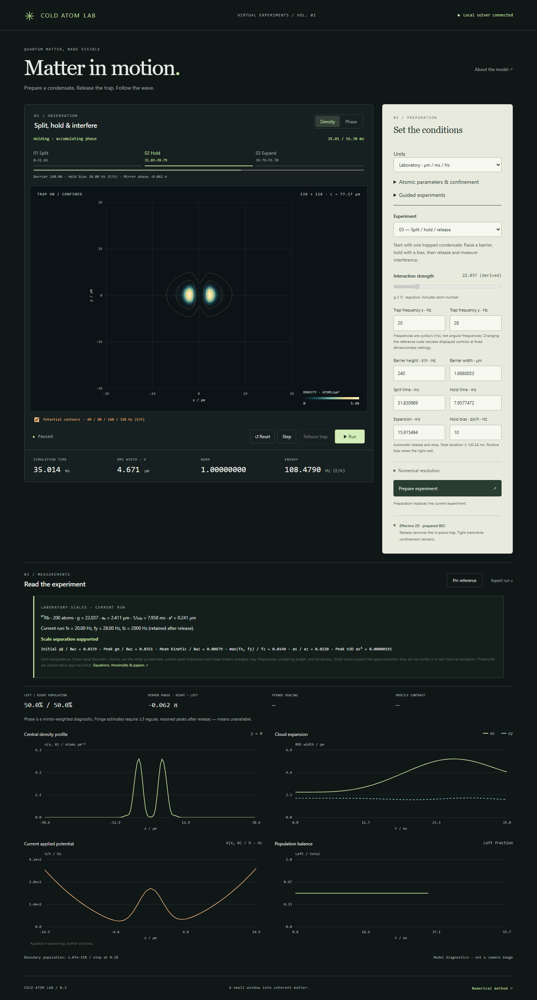

# Cold Atom Lab

An interactive virtual laboratory for exploring Bose–Einstein condensate (BEC) expansion and matter-wave interference.



## Run locally

Requires [uv](https://docs.astral.sh/uv/) and Python 3.11 or newer. From this repository:

```powershell
uv sync
uv run python -m coldatomlab.server
```

Open **http://127.0.0.1:8765**. Stop the server with `Ctrl+C`. Use `--port 8766` if the default port is already occupied. The application runs locally without an account, API key, frontend build, or remote assets.

## Try an experiment

**Expansion:** the initial screen prepares a trapped condensate. Click **Release trap**, then **Run**. Watch the density spread and the RMS widths grow. **Pause** holds the state after the current batch finishes; **Step** advances one numerical step. **Reset** returns to the prepared initial state and restores its settings.

**Interference:** select **Two-cloud interference**, set interaction strength to **0**, and click **Prepare experiment**. These packets start released. Run to approximately `t = 2`, then pause. Prepare again with **Opposite · π** and compare the central density dip to the in-phase case. Try separation or interaction changes to explore different dynamics.

**Dynamic splitting:** select **Split / hold / release** and prepare. **Run** raises a Gaussian barrier to divide the original condensate, applies the selected bias during Hold, then releases the in-plane trap and stops after expansion. The timeline follows the actual simulation; pause or single-step at any stage. Positive bias raises the right well. Try a faster split or reverse the hold bias, then compare the result.

Turn on **Potential contours** to see the changing trap over the density/phase field. The sequence adds a central potential plot and population history. Measurements include left/right fractions, a mirror-weighted phase, and fringe spacing/profile contrast when the pattern is resolved. Energy changes while the external potential is being driven.

**Compare runs:** pause or finish a run and click **Pin reference**. Change settings and prepare the next run. The saved reference remains fixed while density profiles, widths, and measurements are compared on common axes. **Compare settings** exposes both configurations; the caption always shows each snapshot's time. **Clear reference** returns to a single run. References live in the current page and are cleared on reload.

Use **Density / Phase** to switch the observation view. Parameter edits remain pending until **Prepare experiment** is clicked; preparation replaces the current run. Grid, domain size, and time step are under **Numerical resolution**. Numerical warnings stop playback before the cloud significantly reaches the periodic boundary region.

The English interface provides density and masked phase maps, central density profiles, RMS width histories, norm, energy, and boundary population. It adapts to desktop and narrow mobile layouts.

## Laboratory units (v0.3)

Choose **Laboratory · μm / ms / Hz**, then open **Atomic parameters & confinement**. Select Rb-87 or a custom bosonic mass, set N, scattering length, reference frequency and axial confinement. Interaction g is derived automatically. Trap frequencies, barrier energies V/h, lengths and times now use laboratory units. The prepared state's axes and measurements update only after Prepare. The applicability panel reports conservative scale checks, including axial excitation and diluteness estimates; it does not certify a physical realization or finite-temperature validity.

For a guided comparison, open **Guided experiments**, choose **Symmetric reference**, click **Load settings**, **Prepare**, **Run**, then **Pin reference**. Repeat with **Positive bias**, **Reverse bias**, or **Longer hold**. The examples have actual physical scales and tested numerical behavior, but are teaching settings rather than reconstructions of a published apparatus.

See [laboratory formulas, thresholds and the reference map](docs/PHYSICAL_UNITS.md), also available through **Equations, thresholds & papers** in the app. The foundation is Dalfovo et al.'s BEC review, Petrov et al.'s quasi-2D theory, Hadzibabic–Dalibard's 2D-gas review, and Shin et al.'s double-well interferometer. Each reference is linked to the assumption or behavior it informs.

## Save and reproduce

Pause and click **Export run** to download a JSON record containing parameters, preparation metadata, the release protocol, diagnostics, and the final complex wavefunction.

```powershell
uv run python -m coldatomlab.replay "path/to/coldatomlab-single-100.json"
```

Replay computes the experiment again and reports the maximum difference from the saved wavefunction. It exits with an error for a discrepancy above `1e-8`.

With a reference pinned, **Export comparison** saves both complete experiments. The same replay command verifies both records. Sequence timing and bias are included; no manual release action needs to be recreated.

## Validate

```powershell
uv run pytest -q
uv run ruff check .
uv run ruff format --check .
```

With the server running in another terminal:

```powershell
uv run playwright install chromium
uv run python -X utf8 -m scripts.browser_check
uv run python -X utf8 -m scripts.sequence_browser_check
uv run python -X utf8 -m scripts.physical_browser_check
```

Browser checks exercise the actual controls, download and replay a run, compare interference phases, verify invalid-setting recovery and boundary stopping, and capture desktop/mobile screenshots. Reports and generated experiment files go to ignored `artifacts/`. See [validation evidence](docs/VALIDATION.md) for tested cases and limits.

## Model scope

This is an effective two-dimensional Gross–Pitaevskii model of an already prepared, dilute, weakly interacting condensate. In-plane release retains tight transverse confinement. The two-cloud initial state is an ideal coherent Gaussian pair. Dimensionless mode leaves physical scales unspecified. Laboratory mode derives coupling from physical parameters and reports conservative frozen-axial applicability checks.

Laser cooling, condensation formation, a thermal component, full 3D expansion, and camera imaging are outside this release. Density and phase are model diagnostics, not laboratory images. Numerical accuracy depends on the chosen grid, step, and domain; passing reference cases does not validate every parameter combination.

See [the model and conventions](docs/MODEL.md), [implementation plan](PLAN.md), and [agent guidance](AGENTS.md).

## References

- [BEC interference: Nobel Prize educational material](https://www.nobelprize.org/prizes/physics/2001/9850-the-nobel-prize-in-physics-2001-2001-2/)
- [Numerical Solution of the Gross-Pitaevskii Equation for Bose-Einstein Condensation](https://arxiv.org/abs/cond-mat/0303239)
- [Split-step Fourier methods for the Gross-Pitaevskii equation](https://arxiv.org/abs/cond-mat/0411154)
