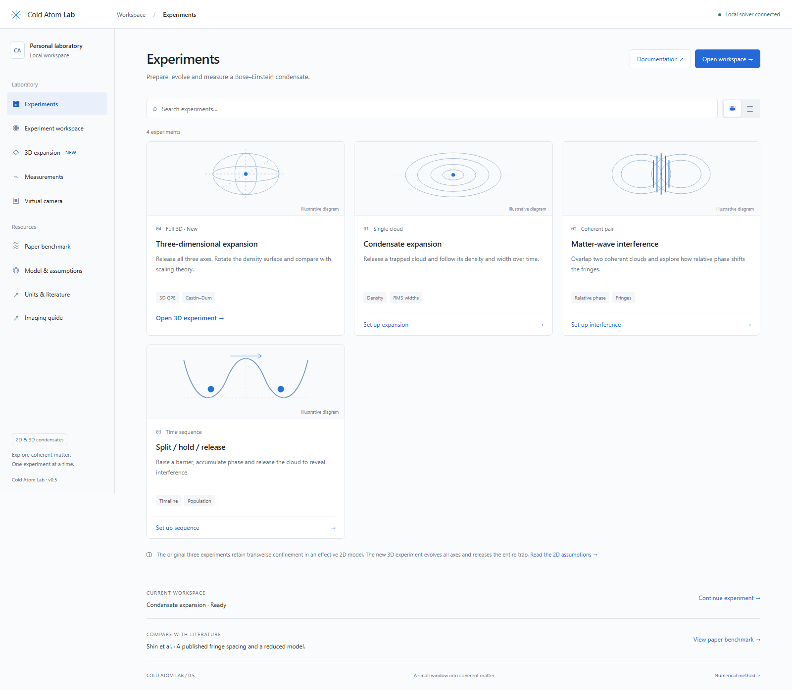
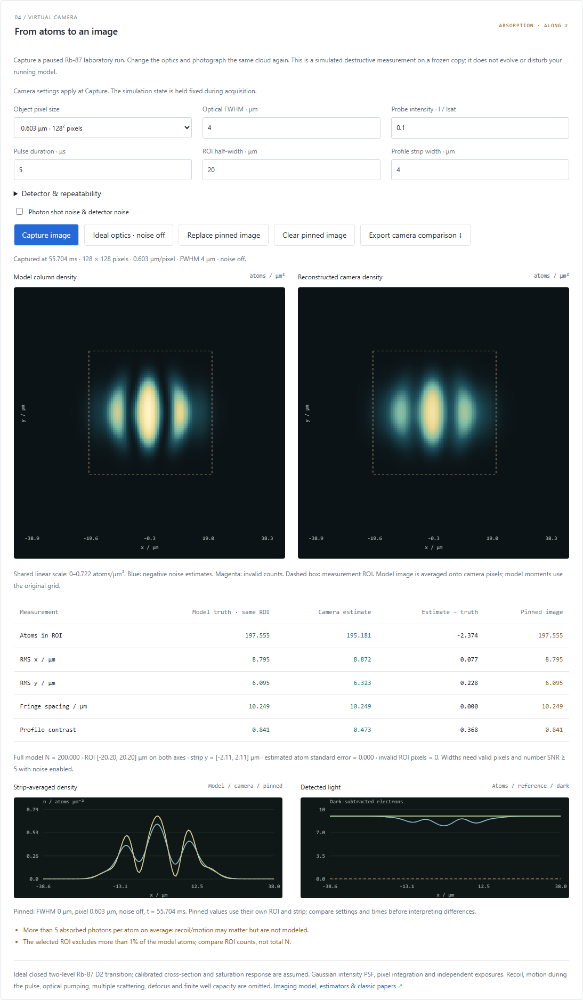

# Cold Atom Lab

An interactive virtual laboratory for exploring Bose–Einstein condensate (BEC) expansion and matter-wave interference.



## Run locally

Requires [uv](https://docs.astral.sh/uv/) and Python 3.11 or newer. From this repository:

```powershell
uv sync
uv run python -m coldatomlab.server
```

Open **http://127.0.0.1:8765**. Stop the server with `Ctrl+C`. Use `--port 8766` if the default port is already occupied. The application runs locally without an account, API key, frontend build, or remote assets.

## Try an experiment

The home page is an **Experiments** dashboard. Search four templates or switch between grid and list views. **3D expansion** opens its own experiment and preparation controls. The original **Set up expansion / interference / sequence** cards stage the experiment type in the 2D workspace; review the settings and click **Prepare experiment** to apply them. **Open workspace** resumes the 2D experiment without changing settings.

The left navigation opens the workspace, measurements, virtual camera and reference guides. On narrow screens, use the menu button. Navigation keeps the current solver session, pending settings and pinned run/image comparisons; it does not pause a running experiment. Reloading still starts a new session and clears pinned records. Template diagrams are labeled illustrations, while workspace plots come from the numerical state. Direct links to `/#workspace`, `/#measurements` and `/#camera-lab` are supported.

**Expansion:** the initial screen prepares a trapped condensate. Click **Release trap**, then **Run**. Watch the density spread and the RMS widths grow. **Pause** holds the state after the current batch finishes; **Step** advances one numerical step. **Reset** returns to the prepared initial state and restores its settings.

**Interference:** select **Two-cloud interference**, set interaction strength to **0**, and click **Prepare experiment**. These packets start released. Run to approximately `t = 2`, then pause. Prepare again with **Opposite · π** and compare the central density dip to the in-phase case. Try separation or interaction changes to explore different dynamics.

**Dynamic splitting:** select **Split / hold / release** and prepare. **Run** raises a Gaussian barrier to divide the original condensate, applies the selected bias during Hold, then releases the in-plane trap and stops after expansion. The timeline follows the actual simulation; pause or single-step at any stage. Positive bias raises the right well. Try a faster split or reverse the hold bias, then compare the result.

Turn on **Potential contours** to see the changing trap over the density/phase field. The sequence adds a central potential plot and population history. Measurements include left/right fractions, a mirror-weighted phase, and fringe spacing/profile contrast when the pattern is resolved. Energy changes while the external potential is being driven.

**Compare runs:** pause or finish a run and click **Pin reference**. Change settings and prepare the next run. The saved reference remains fixed while density profiles, widths, and measurements are compared on common axes. **Compare settings** exposes both configurations; the caption always shows each snapshot's time. **Clear reference** returns to a single run. References live in the current page and are cleared on reload.

Use **Density / Phase** to switch the observation view. Parameter edits remain pending until **Prepare experiment** is clicked; preparation replaces the current run. Grid, domain size, and time step are under **Numerical resolution**. Numerical warnings stop playback before the cloud significantly reaches the periodic boundary region.

The English interface provides density and masked phase maps, central density profiles, RMS width histories, norm, energy, and boundary population. It adapts to desktop and narrow mobile layouts.

## 3D interferometer (v0.7)

Open [the browser GPU lab](http://127.0.0.1:8765/gpu.html), choose **3D split / hold / release**, click **Load settings**, **Prepare 3D experiment**, then **Run**. The barrier splits one condensate, a hold bias controls its phase, and all axes release automatically. The timeline follows actual solver steps. Inspect the axial density, applied potential, left/right populations, mirror phase/coherence and resolved fringe estimates. Pause or finish, **Pin this run**, load **3D sequence · reversed bias**, prepare and run again to compare profiles on shared physical axes. **Export comparison** saves both complete records for replay.

For the analytic control, compare **Coherent pair · in phase** and **Coherent pair · π phase**. These noninteracting packets start released. The experiment selector distinguishes single-cloud expansion, coherent pair and dynamic sequence; edits take effect on Prepare. Both GPU and CPU backends implement the same protocols. The GPU static bundle includes the interferometer without a simulation server.

These are teaching protocols inspired by Shin et al. (2004), with Rb-87 and a declared 3D mean-field potential. They do not reconstruct that sodium apparatus or its camera. Read [formulas, measurement limits, provenance and verification](docs/INTERFEROMETER3D.md). Unresolved fringes and weak-coherence phase estimates remain unavailable.

## Laboratory units (v0.3)

Choose **Laboratory · μm / ms / Hz**, then open **Atomic parameters & confinement**. Select Rb-87 or a custom bosonic mass, set N, scattering length, reference frequency and axial confinement. Interaction g is derived automatically. Trap frequencies, barrier energies V/h, lengths and times now use laboratory units. The prepared state's axes and measurements update only after Prepare. The applicability panel reports conservative scale checks, including axial excitation and diluteness estimates; it does not certify a physical realization or finite-temperature validity.

For a guided comparison, open **Guided experiments**, choose **Symmetric reference**, click **Load settings**, **Prepare**, **Run**, then **Pin reference**. Repeat with **Positive bias**, **Reverse bias**, or **Longer hold**. The examples have actual physical scales and tested numerical behavior, but are teaching settings rather than reconstructions of a published apparatus.

See [laboratory formulas, thresholds and the reference map](docs/PHYSICAL_UNITS.md), also available through **Equations, thresholds & papers** in the app. The foundation is Dalfovo et al.'s BEC review, Petrov et al.'s quasi-2D theory, Hadzibabic–Dalibard's 2D-gas review, and Shin et al.'s double-well interferometer. Each reference is linked to the assumption or behavior it informs.

## Virtual absorption camera (v0.4)

Prepare a physical Rb-87 run and pause or finish it. In **Virtual camera**, use **Ideal optics · noise off**, then **Capture image** to compare model truth with density reconstructed from atom/reference/dark exposures. **Pin image**, change optical FWHM, object pixel size or noise, and capture the same cloud again. The ROI count, RMS widths and strip fringe estimates show the measurement bias directly. No source-state evolution occurs during capture.

For a resolution example, complete the **Positive bias** guided sequence, capture ideal optics, then try FWHM 2, 4 and 8 μm without noise. At 8 μm this example's fringes become unavailable under the stated estimator criteria. Enable photon noise, vary pulse duration or noise seed, and inspect raw-count profiles. Nonpositive counts are masked; low-signal or unresolved measurements are marked unavailable. A pinned exposure survives source changes with its original time/settings.

The camera uses an ideal resonant Rb-87 D2 transition, saturation-corrected absorption, Gaussian intensity blur and pixel integration. Recoil and motion during the pulse are not simulated. See [the imaging model and classic papers](docs/IMAGING.md), also linked from the camera panel, for exact conventions, estimator limits and the role of Ketterle–Durfee–Stamper-Kurn and Reinaudi et al.



## Compare with a paper

Open **Paper benchmark** in the sidebar, or visit **http://127.0.0.1:8765/#benchmark**. This separate calculation compares Shin et al.'s Fig. 2 reported fringe spacing with free expansion of a noninteracting Na-23 Gaussian pair at the reported 13 µm separation and 30 ms expansion time. It does not change the current workspace or use its Rb-87 camera.

The numerical fit gives **40.0574 µm**, compared with the published **41.5 µm** (−3.476%, using the measurement as denominator). The page separates the fit, exact finite-width formula, rounded-input point-source formula and the paper's quoted prediction. This is a one-observable comparison, not experimental validation: the initial width is a surrogate, interactions and 3D preparation are omitted, and the paper supplies no raw numerical profile or period uncertainty. See [reference audit and limitations](docs/SHIN_REFERENCE.md) and [benchmark method](docs/BENCHMARK.md).

**Export benchmark** downloads inputs, provenance, computed/fitted profiles, discrepancies, numerical refinement checks and width sensitivity. Recalculate the report and render a standalone scientific figure with:

```powershell
uv run python -m coldatomlab.benchmark
uv run python -m scripts.benchmark_figure
```

Both write to ignored `artifacts/`. The report has its own `coldatomlab-shin-benchmark-v1` schema; reproduce it with the benchmark command rather than the experiment replay command.

## Interacting 3D expansion (v0.5)

**v0.6 adds WebGPU acceleration.** The 3D page now defaults to **WebGPU · browser GPU · float32**; select **CPU reference · float64** to use the original local solver. On the measured RTX 5070 Ti, fresh interacting 64³ preparation fell from about 28 s to 0.4–0.5 s, with matching-case width differences below 0.0015%. Precision and stopping tolerances differ; see [GPU performance, accuracy and limits](docs/WEBGPU.md). Hardware Chrome and Edge were tested; an embedded browser may not expose WebGPU.

For a **browser-only, shareable version**, open **http://127.0.0.1:8765/gpu.html**. All 3D preparation/evolution runs in the browser without simulation API calls. `uv run python -m scripts.package_webgpu` creates `artifacts/coldatomlab-webgpu.zip` for an ordinary static HTTPS host. No site is published automatically. WebGPU supports 32³/64³/128³; loading its TF preset explicitly uses 128³ instead of the CPU preset's 96³.

Open **3D expansion** in the sidebar, or visit **http://127.0.0.1:8765/#lab3d**. Choose a reference example, **Load settings**, then **Prepare 3D experiment**. Preparation can take tens of seconds or several minutes on the largest grids. **Release all axes**, then **Run**. **Pause**, **Step**, and **Reset** act on this independent 3D session; navigation preserves both it and the original 2D workspace.

Drag the numerical density surface or use arrow keys to rotate it. Zoom and isodensity change only the view. Switch between **Central slices** (atoms/µm³) and **Column density** (atoms/µm²); all three planes use the full solver grid, while the surface states its rendering-grid coarsening. These projections have no absorption-camera model.

The **Noninteracting analytic check** compares widths with the exact Gaussian result. **Interacting cloud** demonstrates finite-interaction expansion. **Thomas–Fermi expansion** uses 150,000 Rb-87 atoms on a 96³ grid and compares all three widths against Castin–Dum scaling, including shape inversion. The absolute TF prediction and scaling anchored to numerical initial widths are shown separately. Finite kinetic energy prevents exact TF agreement; this is a theory benchmark, not a reproduction of measured experimental data.

The panels report norm, energy per atom, aspect ratios, boundary population, preparation residual and measured performance. Advanced controls support time/preparation-step, grid and domain refinement up to 128³. **Export 3D run** saves the full complex field; the same replay command below verifies it. The four-session 3D server limit bounds retained memory; re-preparing an existing page reuses its session.

See [3D conventions and measured checks](docs/MODEL3D.md) and the [Castin–Dum / Dalfovo source audit](docs/3D_REFERENCE.md). Reproduce the extended numerical comparisons with `uv run python -m scripts.validate_3d` (about 15–20 minutes for all refinement cases on the measured machine; writes ignored `artifacts/3d-validation.json`). Then `uv run python -m scripts.three_figure` renders the widths, aspect ratios and numerical checks as a standalone figure.

## Save and reproduce

Pause and click **Export run** to download a JSON record containing parameters, preparation metadata, the release protocol, diagnostics, and the final complex wavefunction.

```powershell
uv run python -m coldatomlab.replay "path/to/coldatomlab-single-100.json"
```

Replay computes the experiment again and reports the maximum difference from the saved wavefunction. It exits with an error for a discrepancy above `1e-8`.

**Export image** saves the source simulation, full camera settings, seed, raw frames and measurements. With an image pinned it exports both acquisitions. The same replay command verifies source evolution and exact camera regeneration, including noise.

With a reference pinned, **Export comparison** saves both complete experiments. The same replay command verifies both records. Sequence timing and bias are included; no manual release action needs to be recreated.

## Validate

```powershell
uv run pytest -q
uv run ruff check .
uv run ruff format --check .
```

With the server running in another terminal:

```powershell
uv run playwright install chromium
uv run python -X utf8 -m scripts.browser_check
uv run python -X utf8 -m scripts.sequence_browser_check
uv run python -X utf8 -m scripts.physical_browser_check
uv run python -X utf8 -m scripts.camera_browser_check
uv run python -X utf8 -m scripts.dashboard_browser_check
uv run python -X utf8 -m scripts.benchmark_browser_check
uv run python -X utf8 -m scripts.three_browser_check
uv run python -X utf8 -m scripts.three_tf_browser_check
uv run python -X utf8 -m scripts.webgpu_check
```

Browser checks exercise the actual controls, download and replay a run, compare interference phases, verify invalid-setting recovery and boundary stopping, and capture desktop/mobile screenshots. Reports and generated experiment files go to ignored `artifacts/`. See [validation evidence](docs/VALIDATION.md) for tested cases and limits.

The WebGPU check requires installed Chrome with a hardware adapter. GPU exports use a separate schema; the replay command performs a toleranced CPU reference comparison rather than claiming exact float32 GPU replay. The GPU norm-drift guard is 0.1%, with no real-time renormalization.

## Model scope

The original workspace uses an effective two-dimensional Gross–Pitaevskii model of an already prepared, dilute, weakly interacting condensate. In-plane release retains tight transverse confinement. The two-cloud initial state is an ideal coherent Gaussian pair. Dimensionless mode leaves physical scales unspecified. Laboratory mode derives coupling from physical parameters and reports conservative frozen-axial applicability checks. The separate v0.5 single-cloud experiment evolves a genuine 3D field with complete trap release and its own coupling convention.

Laser cooling, condensation formation, a thermal component, interacting 3D splitting/interference, and full optical/atomic imaging dynamics are outside this release. The density/phase views are model diagnostics; the separate 2D camera panel produces explicitly simplified synthetic images. Numerical accuracy depends on the chosen grid, step, and domain; passing reference cases does not validate every parameter combination.

See [the model and conventions](docs/MODEL.md), [implementation plan](PLAN.md), and [agent guidance](AGENTS.md).

## References

- [BEC interference: Nobel Prize educational material](https://www.nobelprize.org/prizes/physics/2001/9850-the-nobel-prize-in-physics-2001-2001-2/)
- [Numerical Solution of the Gross-Pitaevskii Equation for Bose-Einstein Condensation](https://arxiv.org/abs/cond-mat/0303239)
- [Split-step Fourier methods for the Gross-Pitaevskii equation](https://arxiv.org/abs/cond-mat/0411154)
